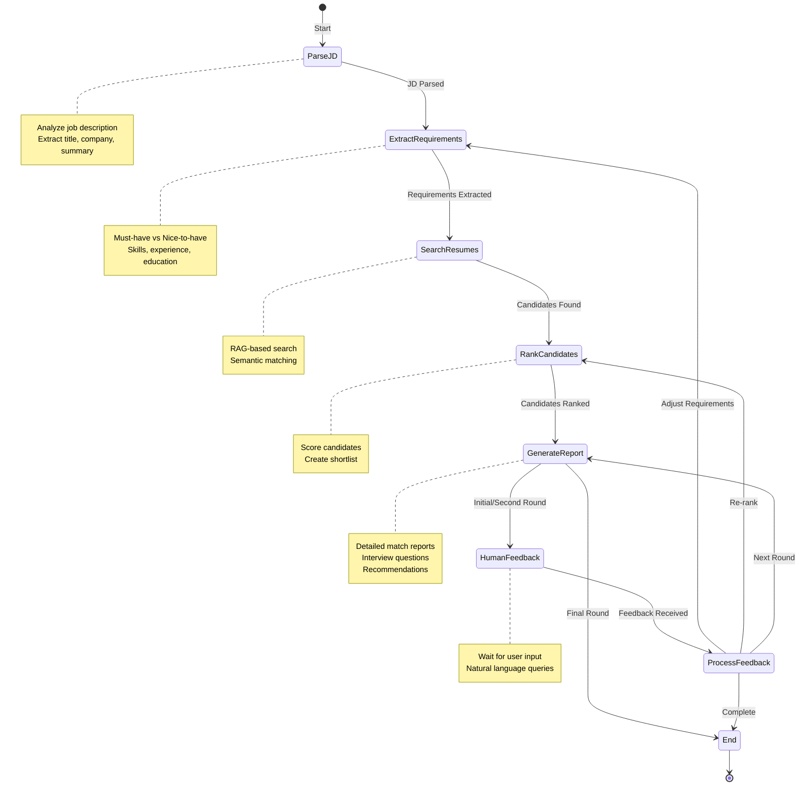

# Resume Matching Agent - State Machine Diagram

## Visual Workflow Diagram



## Detailed Workflow

```
┌─────────────────────────────────────────────────────────────────────────────┐
│                         RESUME MATCHING AGENT WORKFLOW                       │
└─────────────────────────────────────────────────────────────────────────────┘

     ┌─────────┐
     │  START  │
     └────┬────┘
          │
          ▼
┌─────────────────────┐
│      PARSE JD       │  ◄── Input: Raw job description text
│  ─────────────────  │
│  • Extract title    │
│  • Parse structure  │
│  • Create summary   │
└──────────┬──────────┘
           │
           ▼
┌─────────────────────────┐
│  EXTRACT REQUIREMENTS   │  ◄── Uses: extract_requirements tool
│  ─────────────────────  │
│  • Must-have items      │
│  • Nice-to-have items   │
│  • Skills (tech/soft)   │
│  • Experience years     │
│  • Education level      │
└──────────┬──────────────┘
           │
           ▼
┌─────────────────────┐
│   SEARCH RESUMES    │  ◄── Uses: RAG search, file system tools
│  ─────────────────  │
│  • Semantic search  │
│  • Load from files  │
│  • Build pool       │
└──────────┬──────────┘
           │
           ▼
┌─────────────────────┐
│   RANK CANDIDATES   │  ◄── Uses: score_candidate, rank_candidates
│  ─────────────────  │
│  • Score each       │
│  • Apply weights    │
│  • Create shortlist │
└──────────┬──────────┘
           │
           ▼
┌─────────────────────┐
│  GENERATE REPORT    │  ◄── Uses: generate_match_report
│  ─────────────────  │
│  • Match reports    │
│  • Recommendations  │
│  • Interview Qs     │
└──────────┬──────────┘
           │
           ▼
      ┌─────────┐
      │ Round?  │
      └────┬────┘
           │
    ┌──────┴──────┐
    │             │
    ▼             ▼
┌────────┐    ┌───────┐
│Initial │    │ Final │
│/Second │    │       │
└───┬────┘    └───┬───┘
    │             │
    ▼             ▼
┌─────────────┐  ┌─────┐
│   HUMAN     │  │ END │
│  FEEDBACK   │  └─────┘
└──────┬──────┘
       │
       ▼
┌───────────────┐
│   PROCESS     │
│   FEEDBACK    │
└───────┬───────┘
        │
    ┌───┴───┬───────┬────────┐
    │       │       │        │
    ▼       ▼       ▼        ▼
┌──────┐┌──────┐┌──────┐┌──────┐
│Adjust││Rerank││ Next ││ End  │
│Reqs  ││      ││Round ││      │
└──┬───┘└──┬───┘└──┬───┘└──────┘
   │       │       │
   └───┬───┴───┬───┘
       │       │
       ▼       ▼
    Back to   Back to
    Extract   Rank or
    Reqs      Report
```

## Screening Rounds Detail

```
╔══════════════════════════════════════════════════════════════════════════╗
║                        MULTI-ROUND SCREENING PROCESS                      ║
╠══════════════════════════════════════════════════════════════════════════╣
║                                                                          ║
║   ROUND 1: INITIAL SCREEN                                                ║
║   ──────────────────────────────────────────────────────────────────    ║
║   Input:  Up to 100 resumes from resume pool                            ║
║   Output: Top 10 candidates                                              ║
║   Focus:  Basic requirements matching                                    ║
║   Method: Quick scoring against must-have criteria                       ║
║                                                                          ║
║                              │                                           ║
║                              ▼                                           ║
║                                                                          ║
║   ROUND 2: DEEP ANALYSIS                                                 ║
║   ──────────────────────────────────────────────────────────────────    ║
║   Input:  Top 10 candidates from Round 1                                 ║
║   Output: Top 5 candidates                                               ║
║   Focus:  Detailed skill and experience matching                         ║
║   Method: Comprehensive scoring, side-by-side comparison                 ║
║                                                                          ║
║                              │                                           ║
║                              ▼                                           ║
║                                                                          ║
║   ROUND 3: FINAL RECOMMENDATIONS                                         ║
║   ──────────────────────────────────────────────────────────────────    ║
║   Input:  Top 5 candidates from Round 2                                  ║
║   Output: Top 3 with hire/maybe/no-hire recommendations                  ║
║   Focus:  Final decision making                                          ║
║   Method: Complete reports, interview questions, recommendations         ║
║                                                                          ║
╚══════════════════════════════════════════════════════════════════════════╝
```

## Scoring Methodology

```
┌─────────────────────────────────────────────────────────────────────────┐
│                          SCORING WEIGHTS                                 │
├─────────────────────────────────────────────────────────────────────────┤
│                                                                         │
│   Must-Have Requirements Match     ████████████████████  50%           │
│                                                                         │
│   Experience Match                 ████████              20%           │
│                                                                         │
│   Nice-to-Have Requirements Match  ██████                15%           │
│                                                                         │
│   Education Match                  ████                  10%           │
│                                                                         │
│   Skills Breadth                   ██                     5%           │
│                                                                         │
└─────────────────────────────────────────────────────────────────────────┘
```

## Query Types

```
┌──────────────────────────────────────────────────────────────────────────┐
│                         SUPPORTED QUERY TYPES                            │
├──────────────────────────────────────────────────────────────────────────┤
│                                                                          │
│  🔍 SEARCH QUERIES                                                       │
│  ─────────────────                                                       │
│  • "Find candidates with React and 3+ years experience"                  │
│  • "Show me Python developers with AWS knowledge"                        │
│  • "Looking for senior developers with leadership experience"            │
│                                                                          │
│  📊 COMPARISON QUERIES                                                   │
│  ──────────────────────                                                  │
│  • "Compare the top 3 matches side by side"                              │
│  • "How do Alice and Bob compare?"                                       │
│  • "Give me a detailed comparison of candidates"                         │
│                                                                          │
│  ❓ EXPLANATION QUERIES                                                  │
│  ───────────────────────                                                 │
│  • "Why did John rank higher than Jane?"                                 │
│  • "Explain the ranking methodology"                                     │
│  • "What are Alice's strengths and weaknesses?"                          │
│                                                                          │
│  ⚙️ ADJUSTMENT QUERIES                                                   │
│  ──────────────────────                                                  │
│  • "Add Kubernetes as a must-have requirement"                           │
│  • "Remove the education requirement"                                    │
│  • "Increase weight for AWS experience"                                  │
│                                                                          │
│  🎮 CONTROL QUERIES                                                      │
│  ─────────────────                                                       │
│  • "Proceed to next round"                                               │
│  • "Show me the final report"                                            │
│  • "Generate interview questions for the top candidate"                  │
│                                                                          │
└──────────────────────────────────────────────────────────────────────────┘
```
